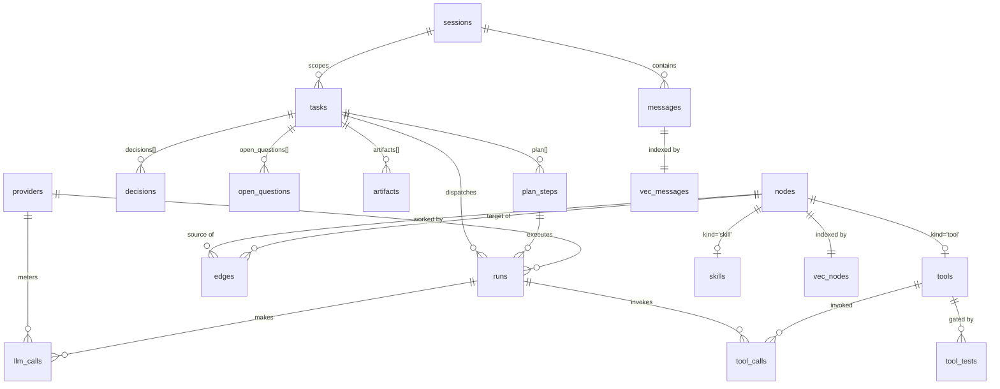

# Minimality — Database Architecture

Executable DDL lives in [`schema/schema.sql`](../schema/schema.sql). This doc
explains the design. Companion to [`DIRECTION.md`](DIRECTION.md) — section
references (§2.x) point there.

---

## 1. The one rule that makes everything else work

**Three layers, one source of truth:**

| Layer | Technology | Role | Rebuildable? |
|---|---|---|---|
| Relational | plain SQLite tables | **source of truth** — all content lives here | n/a |
| Vector | sqlite-vec `vec0` tables | KNN index over messages & nodes | yes, from layer 1 |
| Graph | graphqlite nodes/edges | traversal index, mirrors `nodes` + `edges` tables | yes, from layer 1 |

sqlite-vec and graphqlite never hold anything you can't regenerate by
re-embedding / re-upserting from the relational tables. This is the standard
"derived data" discipline (same reason a search index isn't your database) and
it's what saves you when:

- you swap embedding models (drop the vec tables, re-embed — `system_meta`
  records which model/dim produced the current vectors, so a mismatch is
  detectable instead of silently returning garbage neighbors);
- graphqlite has a bug or you outgrow it (rebuild the mirror, or swap the
  library, without touching data);
- you need to migrate schema (only layer 1 migrates; indexes are recreated).

Your current schema already violates this in one spot: the entity graph in
graphqlite is the *only* home of relationships. The new `edges` table fixes
that — graphqlite becomes `for each row in edges: G.upsert_edge(...)`.

Everything stays in **one SQLite file** (WAL mode, `foreign_keys=ON`,
`STRICT` tables). One file = one `cp` backs up the entire system state —
memory, ledger, tools, telemetry. If telemetry (`llm_calls`, `tool_calls`)
ever bloats the file, archive old rows to a second file; don't split
architecturally.

---

## 2. Entity–relationship overview



---

## 3. Design decisions, table by table

### 3.1 `nodes` — one universal node table (replaces `entities`)

Entities, tools, and skills are all rows in `nodes`, discriminated by `kind`;
tools and skills carry their extra columns in subtype tables keyed on
`node_id` (**class-table inheritance** — the textbook relational pattern for
"same thing at the graph level, different payloads").

Why this instead of separate `entities` / `tools` / `skills` tables with a
polymorphic edges table:

- **Real foreign keys.** `edges(source_id → nodes.id)` is enforceable. A
  polymorphic `(kind, id)` pair can't have FK integrity — that's the classic
  polymorphic-association anti-pattern.
- **One graph namespace.** `tool -[depends_on]-> library-entity` and
  `entity -[is_a]-> entity` are the same edge machinery. The Tool Forge's
  graph integration (§2.2) falls out for free.
- **One embedding index.** `vec_nodes` covers entities, tool docstrings, and
  skill cards; the `kind` metadata column gives filtered KNN ("5 nearest
  *tools*") in one query.

`UNIQUE(name, kind)` rather than `UNIQUE(name)`: a tool named `search` must
not collide with an entity named `search`.

### 3.2 `edges` — relationships get a relational home

Carries `evidence` (the exact text span, per your `extraction.py` schema) and
`confidence` — provenance your current graph silently drops.
`UNIQUE(source_id, target_id, rel_type)` allows two nodes to be related in
multiple ways (`uses` *and* `depends_on`) while deduplicating repeats — your
current `has_edge` check collapses all rel types into one edge slot.
`ON DELETE CASCADE` keeps the graph consistent when a node is deleted.

**Graph mirror contract:** node label = `kind`, node key = `nodes.id`,
edge type = `rel_type`. A `rebuild_graph()` function that truncates and
re-upserts is the whole sync strategy — cheap at this scale, and idempotent.

### 3.3 `sessions` + `messages` (replaces `episodic_logs`)

- `session_id` was missing entirely — without it you can't reconstruct a
  conversation, only a soup of rows.
- `sensitivity` defaults to `'local_only'` — **the safe direction**. The Qwen
  classifier *upgrades* rows to `shareable`; a classifier crash then fails
  closed (nothing leaks), not open. On `nodes`, the default is `shareable`
  because technical terms are the common case; the classifier can still
  demote.
- `provider_id` on assistant messages records who actually wrote each
  response — provenance for debugging quality issues after the fact.
- `role` gains `'tool'` for tool-result turns in the plain-text tool-calling
  loop.

### 3.4 Task Ledger: `tasks`, `plan_steps`, `decisions`, `open_questions`, `artifacts`

The ledger (§2.1) is deliberately **normalized into child tables rather than
one JSON blob**. The orchestrator makes many small targeted updates ("mark
step 3 done", "add a decision") — with child rows each update is a one-row
`UPDATE`/`INSERT` instead of read-modify-write on a growing JSON document
(no lost-update races, no rewriting the whole ledger per turn). It also makes
the ledger queryable: "all blocked steps", "decisions from the last hour".
The briefing-pack renderer is just a handful of ordered `SELECT`s.

`artifacts.sha256` pins what a file contained when registered, so a later
(possibly buggy) tool overwriting it is detectable.

### 3.5 `providers` + `llm_calls`: meters are views, not counters

`providers` stores identity, declared limits, and — critically —
`api_key_env`, the **name** of the environment variable holding the key.
Secrets never enter the database (industry standard; also means the DB file
is safe to back up anywhere).

Usage metering follows the **append-only event log + derived views** pattern
instead of mutable counter columns:

- `llm_calls` gets one insert per API request (tokens, latency, status).
- `v_provider_minute_usage` / `v_provider_day_usage` compute live meters with
  a time-windowed `GROUP BY`.

Counters need reset logic, drift when a write is missed, and can't answer
"what happened at 3am". An event log has none of those problems, and at your
volume (thousands of rows/day) the windowed aggregates are instant with the
`(provider_id, created_at)` index. The `parse_error` status directly feeds
the "log every tool-fence parse failure per provider" signal.

### 3.6 `runs`: the bandit's unit of account

One row per orchestrator dispatch: which task, which step, which provider,
what `task_type`, and — after sandbox verification — the `outcome`.
`v_bandit_scores` (success rate per provider × task_type, 14-day window) is
the router's entire input; epsilon-greedy needs nothing else stored.
`provider_id IS NULL` means the run was handled locally via a skill card —
which makes "cloud-call rate over time" (the §2.3 metric) a one-line query.

### 3.7 Tool Forge: `tools`, `tool_tests`, `tool_calls`

- `tools` is a subtype of `nodes` — name/description live on the node row
  (so tool retrieval is plain `vec_nodes` KNN with `kind='tool'`); code,
  version, JSON-schema `signature`, and lifecycle `status` live here.
- Lifecycle enum includes `quarantined` — the state for a promoted tool that
  starts failing in the wild (distinct from `deprecated`, which is
  intentional retirement).
- `tool_tests` holds the authoring model's example invocations; **promotion
  is a state transition gated on all rows passing**, enforced in the
  promotion code path (SQLite CHECKs can't span tables).
- `tool_calls` logs every invocation with `ok` and duration — per-tool
  reliability stats, and the audit trail for "what did this tool actually do
  in run 217".
- Tool dependencies are **edges**, not columns: promote a tool → upsert its
  node → add `depends_on` edges to library/tool nodes. Impact analysis
  ("what breaks if `requests` is unavailable?") is a graph traversal.

### 3.8 `skills`

Subtype of `nodes` (kind='skill'); description on the node is what gets
embedded and retrieved, `procedure` holds the full markdown skill card.
`success_count`/`failure_count` are the local-first router's confidence
signal; `source_run_id` links back to the cloud run it was distilled from
(provenance: which teacher taught this).

### 3.9 Vector layer

- `vec_messages(message_id, embedding)` and `vec_nodes(node_id, embedding, kind)`
  replace `vector_mem` / `vector_fact_mem`. IDs equal the source-table PKs
  (the pattern you already use — kept).
- `kind` on `vec_nodes` is a sqlite-vec **metadata column** (≥ 0.1.6):
  `WHERE embedding MATCH ? AND k = 5 AND kind = 'tool'` filters *during* KNN
  instead of post-filtering (which silently returns fewer than k rows).
- Dim stays 256 (truncated jina vectors). Model + dim are recorded in
  `system_meta`; change either → rebuild both vec tables.

### 3.10 Conventions (the "industry standard" checklist)

| Convention | Choice |
|---|---|
| Types | `STRICT` tables (SQLite ≥ 3.37) — no silent type coercion |
| Timestamps | `TEXT` ISO-8601 UTC with ms; sorts lexicographically, human-readable, works with `strftime` windows |
| Enums | `CHECK (col IN (...))` |
| Booleans | `INTEGER` + `CHECK (x IN (0,1))` |
| JSON | `TEXT` + `CHECK (json_valid(...))`; used only for genuinely unstructured payloads (metadata, verification detail), never for data you query by |
| Keys | `INTEGER PRIMARY KEY` (rowid alias) everywhere; natural keys get `UNIQUE` |
| FKs | declared + `PRAGMA foreign_keys=ON` (off by default in SQLite!) with explicit `ON DELETE` behavior |
| Migrations | `schema_migrations` version table from day one |
| Secrets | never stored; env-var names only |
| Concurrency | WAL + `busy_timeout=5000`; route all writes through one connection owned by a single writer (fixes the current shared-cursor / `check_same_thread=False` hazard) |

---

## 4. The queries the architecture exists to serve

**Briefing pack for a cloud worker** (§2.1 + §2.6) — note every outbound
query filters `sensitivity = 'shareable'`:

```sql
-- ledger core
SELECT goal, constraints FROM tasks WHERE id = :task;
SELECT position, description, status, result_summary
  FROM plan_steps WHERE task_id = :task ORDER BY position;
SELECT decision, rationale FROM decisions
  WHERE task_id = :task ORDER BY id DESC LIMIT 10;
SELECT question FROM open_questions WHERE task_id = :task AND status = 'open';

-- relevant memory (shareable only)
SELECT m.content
FROM vec_messages v JOIN messages m ON m.id = v.message_id
WHERE v.embedding MATCH :query_vec AND k = 5
  AND m.sensitivity = 'shareable';
```

**Tool retrieval** (§2.2) — top-5 promoted tools for the task at hand:

```sql
SELECT n.name, n.description, t.signature
FROM vec_nodes v
JOIN nodes n ON n.id = v.node_id
JOIN tools t ON t.node_id = n.id
WHERE v.embedding MATCH :task_vec AND k = 5 AND v.kind = 'tool'
  AND t.status = 'promoted';
```

**Routing decision** (§2.5) — candidates with quota headroom, ranked:

```sql
SELECT p.id, p.name, COALESCE(b.success_rate, 0.5) AS score  -- 0.5 = optimistic prior
FROM providers p
LEFT JOIN v_provider_minute_usage mu ON mu.provider_id = p.id
LEFT JOIN v_provider_day_usage    du ON du.provider_id = p.id
LEFT JOIN v_bandit_scores b
       ON b.provider_id = p.id AND b.task_type = :task_type
WHERE p.enabled = 1
  AND (p.rpm_limit IS NULL OR COALESCE(mu.requests_1m, 0) < p.rpm_limit)
  AND (p.rpd_limit IS NULL OR COALESCE(du.requests_24h, 0) < p.rpd_limit)
ORDER BY score DESC;
```

**Skill-first check** (§2.3) — before spending cloud quota:

```sql
SELECT n.name, s.procedure, s.success_count, s.failure_count
FROM vec_nodes v
JOIN nodes n ON n.id = v.node_id
JOIN skills s ON s.node_id = n.id
WHERE v.embedding MATCH :task_vec AND k = 3 AND v.kind = 'skill'
  AND s.task_type = :task_type;
```

---

## 5. Migration from the current schema

| Current | Becomes | Notes |
|---|---|---|
| `episodic_logs` | `messages` | add `session_id` (backfill one legacy session), `sensitivity='local_only'` |
| `entities` | `nodes` (kind='entity') | ids preserved; add type/description/aliases as NULL |
| `vector_mem` | `vec_messages` | re-create; copy vectors (same ids, same model) |
| `vector_fact_mem` | `vec_nodes` | re-create with `kind` metadata col; copy with kind='entity' |
| graphqlite edges | `edges` + rebuilt mirror | export via `MATCH (a)-[r]->(b)` (see `audit.py`), insert into `edges`, then `rebuild_graph()` |
| `DB_URL` hardcoded path | config/env (`MINIMALITY_DB`) | prerequisite for everything |

Order: create new tables → copy data → rebuild vec + graph indexes → drop old
tables → `INSERT INTO schema_migrations(version) VALUES (1)`.

New tables with no predecessor (`tasks`, `plan_steps`, `decisions`,
`open_questions`, `artifacts`, `providers`, `llm_calls`, `runs`, `tools`,
`tool_tests`, `tool_calls`, `skills`) simply start empty — Phase 1–4 of the
roadmap fills them in.
