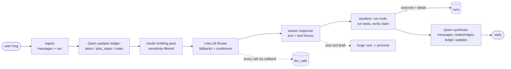

# Minimality — 3-Week MVP Plan

**This doc supersedes the full design for the v1 build.** `DIRECTION.md`
stays the north star; `DB_SCHEMA.md`/`WORKFLOW.md` describe the eventual
system. This is what actually ships in 3 weeks.

The simplification strategy: **every hand-rolled subsystem that has an
industry-standard library gets replaced by the library.** What remains
custom is only what makes Minimality *Minimality*: the ledger, the
briefing pack, the tool forge, and the memory schema.

---

## 1. The library lineup

| Concern | Was (full design) | Now | Why |
|---|---|---|---|
| Multi-provider client | hand-rolled OpenAI-compatible wrapper | **LiteLLM** | one `completion()` for 100+ providers, incl. `ollama/...` for local Qwen — cloud and local through the same interface |
| Orchestrator loop | hand-rolled dispatch loop | **LangGraph** (`StateGraph` + `SqliteSaver` checkpointer) | the stage pipeline is literally a state graph; the SQLite checkpointer means a crashed/interrupted task resumes at the exact node it died on — same file as everything else, and it *strengthens* the resumability thesis rather than competing with the ledger |
| LLM observability | custom trace logging (deferred) | **Langfuse** | LiteLLM ships a built-in Langfuse callback — one config line gives full tracing of every worker/orchestrator call (free cloud tier or self-hosted); `llm_calls` stays as the local queryable copy |
| Tool interop (stretch) | — | **MCP** (official Python SDK) | expose *promoted forge tools* as a Model Context Protocol server — agent-forged tools usable from Claude/other MCP clients; small surface, very original |
| Provider registry + limits | `providers` table | **LiteLLM Router** `config.yaml` | `model_list` with per-deployment `rpm`/`tpm`, keys via `os.environ/...` |
| Failover + quota rotation | meter views + custom router | **LiteLLM Router** fallbacks + cooldowns | 429 → automatic fallback chain, exhausted deployment cools down — this was ~a week of custom work, now config |
| Usage telemetry | custom per-call logging | **LiteLLM callbacks** → `llm_calls` | `success_callback`/`failure_callback` write one row per request |
| Retries/backoff | hand-rolled | **LiteLLM** (`num_retries`) + **tenacity** for sandbox/db | solved problem |
| Structured extraction | regex JSON scraping | **instructor** + **pydantic** (already in repo) | keep `extraction.py`'s pydantic models, point instructor at LiteLLM |
| Embeddings | raw `AutoModel` + manual truncation | **sentence-transformers** | 3 lines, handles device placement; same jina model, dim 256 |
| Vector search | sqlite-vec | **sqlite-vec** (keep) | already working; no server to run, one-file backup preserved |
| Graph store | graphqlite mirror | **plain SQL on `edges`** (+ **networkx** only for dashboard viz) | one-hop is a JOIN, multi-hop is a recursive CTE; a graph DB was the biggest cost for the least MVP value |
| Config | constants in code | **pydantic-settings** (`.env`) | kills the hardcoded `DB_URL`, holds API keys |
| Packaging / DX | none | **uv** + **ruff** + **pytest** | standard 2026 Python toolchain |
| UI | Streamlit | **Streamlit** (keep) | already there |

**Worker model lineup** (pure config, zero build cost — name them in the
README): DeepSeek R1/V3 (via OpenRouter `:free`), **Mistral** (La Plateforme),
**Nous Hermes** (OpenRouter free variants), Llama, Qwen (local via Ollama,
orchestrator), and **Phi-4** as a second local small model where useful.
Heterogeneous open-model fleet is the point of the architecture — listing it
costs nothing and reads exactly like the job postings do.

One deliberate near-miss: **PydanticAI** overlaps almost entirely with the
instructor + pydantic + LangGraph combination already in the stack. Running
two agent frameworks reads as keyword stuffing to a human reviewer even where
an ATS likes it — pydantic itself is already all over the codebase and is the
honest claim. Revisit only if instructor chafes.

Two deliberate non-libraries:

- **Tool-call parsing** stays the plain-text fence convention (~30 lines).
  LiteLLM *can* normalize native function calling, but free-tier deployments
  of open models are exactly where native tool support is flaky — the fence
  works identically on every model. Revisit post-MVP.
- **Sandbox** stays `subprocess.run` with timeout + `resource.setrlimit` +
  a per-session workspace dir (~50 lines). Container isolation is a v2
  upgrade, documented as such.

## 2. What got cut from the schema (21 objects → 13)

New `schema/schema.sql` is the v1 truth. Moves:

| Cut | Where it went |
|---|---|
| `providers` table | LiteLLM `config.yaml` |
| `v_provider_minute/day_usage` views | LiteLLM rpm/tpm limits + cooldowns |
| `v_bandit_scores` + bandit routing | **deferred** — LiteLLM fallback order is the v1 "policy"; `runs.outcome` still recorded, so the bandit can be added later without a migration |
| `decisions`, `open_questions` | merged into `notes(kind, content, resolution)` |
| `tool_tests`, `tool_calls` | `tools.tests` JSON / `runs.detail` JSON |
| `artifacts` | `runs.detail` JSON (paths + sha256) |
| `skills` + distillation | **deferred** — `nodes.kind` still reserves `'skill'` |
| `schema_migrations` | `system_meta['schema_version']` |
| graphqlite mirror + rebuild flow | dropped; SQL queries on `edges` |
| sensitivity classifier as a pipeline stage | kept, but as one Qwen call fired async after insert; default stays fail-closed `local_only` |

Everything deferred has a seat saved (reserved enum value, recorded column)
so it's an addition later, not a migration.

## 3. Simplified workflow (replaces WORKFLOW.md stages 0–10 for v1)

Same shape as the full design; stages didn't change, their *implementations*
shrank. The briefing pack / handoff mechanism is untouched — it was never
the expensive part, and it's the thesis.

## 4. Three-week schedule

Assumes solo, part-time-plus. Each week ends in something demoable; if a
week overruns, cut from the bottom of that week, not the next milestone.

### Week 1 — "many models, one memory" (foundation + provider layer)
- **D1–2**: `uv init`, pyproject, ruff, pytest; `pydantic-settings` config
  (`MINIMALITY_DB`, keys); apply new `schema.sql`; port `Memory_Manager` →
  slim `memory.py` on sentence-transformers; **close the write loop**
  (messages actually inserted); delete dead code + the regex extractor.
- **D3–4**: LiteLLM Router `config.yaml`: 4–6 free deployments (e.g. Groq,
  Gemini free tier, Mistral free tier, OpenRouter `:free` DeepSeek/Hermes) +
  local `ollama/qwen` as its own deployment; fallback chains, cooldowns;
  usage callback → `llm_calls` **and enable the built-in Langfuse callback**
  (account signup is minutes; do it D1 with the provider keys).
  Point instructor at LiteLLM for extraction.
- **D5–7**: wire the chat loop end-to-end in Streamlit: ingest → retrieve
  (vec + one-hop edges) → respond via Router → async extract entities/edges +
  classify sensitivity. Smoke tests.
- **✅ Milestone 1**: a conversation with memory that *survives a 429* —
  unplug a provider mid-chat, answers keep coming.

### Week 2 — "the orchestrator" (ledger + briefing pack + sandbox)
- **D8–9**: ledger CRUD; orchestrator skeleton as a **LangGraph
  `StateGraph`** — nodes = the §3 stages, state = current task/step ids +
  scratch, checkpointed with `SqliteSaver` into the same DB file. Qwen
  (through LiteLLM, same interface as workers) maintains
  tasks/plan_steps/notes each turn.
- **D10–11**: briefing-pack renderer: ledger + top-k `shareable` memory +
  top-k promoted tools → system prompt. Unit-test the sensitivity filter
  (this is the one test that must never regress).
- **D12–13**: sandbox runner (subprocess, rlimits, workspace dir); worker
  states expected outcome → sandbox verifies → `runs.outcome` + `detail`.
- **D14**: **✅ Milestone 2 — the thesis demo**: start a multi-step coding
  task, disable the active provider mid-task, watch it finish on the next
  provider with no visible seam. Record it.
- Overrun cut line: verification can degrade to "did the code run without
  error" for now.

### Week 3 — "tools + a face" (forge + dashboard + hardening)
- **D15–16**: tool fence parser; forge lifecycle: draft (node + tools row +
  tests JSON) → sandbox runs tests → promote → embed into `vec_nodes`
  (`kind='tool'`) + `depends_on` edges.
- **D17**: tool retrieval into the briefing pack (top-5 promoted, filtered KNN).
- **D18–19**: Streamlit dashboard tabs: ledger live view; provider stats from
  `llm_calls` (calls, tokens, error rates); tool library; simple edges viz
  (networkx). *(Load the repo's dataviz skill/conventions if charting.)*
- **D20–21**: buffer, README with the demo recording, `pytest` pass, tag `v0.1`.
- Overrun cut line: dashboard tabs after "ledger + provider stats".

### Explicitly deferred (post-MVP, in order of payoff)
1. **MCP server over promoted tools** (official Python SDK) — first in line
   because it's small and the "agent-forged tools served over MCP" story is
   the most original résumé line in the project; pull it into D20–21 if the
   buffer survives
2. Bandit routing on `runs` outcomes (data is already being collected)
3. Skill distillation (`kind='skill'` reserved)
4. Container sandbox
5. Tool quarantine automation; native function-calling via LiteLLM where reliable

## 6. Keyword coverage (for READMEs, postings, and interviews)

Every term below is *earned* by the architecture — claimable without
hand-waving. Use this exact language in the README:

| Posting keyword | Where it's true in this project |
|---|---|
| **Agentic AI / autonomous agents** | orchestrator loop: plan → dispatch → execute → verify → synthesize |
| **LangGraph / LangChain ecosystem** | orchestrator `StateGraph` with SQLite checkpointing |
| **LLM observability / tracing / Langfuse** | full-trace instrumentation of every model call via LiteLLM callback |
| **Multi-provider routing / LiteLLM** | quota-aware failover across DeepSeek, Mistral, Hermes, Llama, Qwen, Phi |
| **RAG** | vector retrieval (sqlite-vec) over episodic memory |
| **GraphRAG / knowledge graphs** | entity/relationship graph (`nodes`/`edges`) merged into retrieval context |
| **Structured outputs / pydantic** | instructor-validated extraction and ledger writes |
| **Tool use / function calling** | provider-agnostic tool-call protocol + self-built persistent tools |
| **MCP (Model Context Protocol)** | (post-MVP) forge tools exposed as an MCP server |
| **Evals / LLM evaluation** | execution-based verification harness; per-provider, per-task-type success rates from `runs` |
| **Sandboxed code execution** | resource-limited subprocess namespace with artifact tracking |
| **Local LLM / Ollama / edge inference** | Qwen orchestrator + Phi running locally, hybrid local/cloud split |
| **Memory / stateful agents** | task ledger + episodic/semantic memory; mid-task provider handoff with zero context loss |

Framing tip for interviews: the demo is Milestone 2 (mid-task provider
handoff), the differentiators are the tool forge and the briefing-pack
resumability — lead with those, let the keyword stack be table stakes.

## 5. Risks to the 3 weeks specifically

| Risk | Containment |
|---|---|
| Free-tier signup/key friction eats D3 | start key signups on D1 in the background; 3 working providers is enough for the demo |
| LiteLLM config rabbit hole (it has *many* knobs) | use only `model_list`, `fallbacks`, `cooldown_time`, `num_retries`, callbacks — nothing else in v1 |
| Qwen ledger updates are unreliable | ledger writes go through instructor with pydantic schemas — malformed output is a retry, not a corrupt ledger |
| Sandbox scope creep | it's 50 lines and a documented threat model; resist hardening until v2 |
| Week-3 polish squeezes the forge | forge before dashboard — a CLI-only forge still proves the loop; a dashboard without tools doesn't |
