# Minimality — Workflow Graph & Data Lineage

> **v1 note:** the 3-week build implements a simplified version of these
> flows — see [`MVP.md`](MVP.md) §3 for the v1 workflow and what each stage
> shrank to. This doc remains the full-design reference.

Companion to [`DB_SCHEMA.md`](DB_SCHEMA.md) (what the tables are) and
[`DIRECTION.md`](DIRECTION.md) (why). This doc shows **when each table is
touched during a turn, and what data feeds which column**.

Legend used in every diagram:

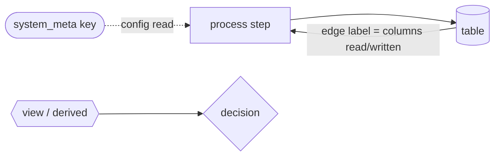

- `[(cylinder)]` = relational table (source of truth)
- `{{hexagon}}` = derived view or rebuildable index (vec / graph layers)
- `([stadium])` = a single `system_meta` **key as its own node** — meta values
  are configuration inputs to processes, not part of the data flow, so each
  key gets its own node and dotted edges
- solid edge = data write/read on the hot path; dotted edge = config read
- edge labels name the exact columns involved

---

## 0. One turn, end to end

Every numbered stage has its own detailed graph below.

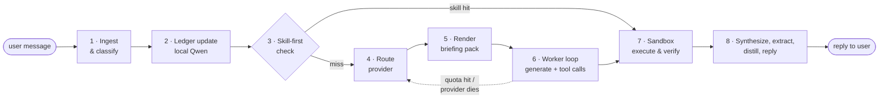

The dotted loop `6 → 4` is the failover path: because state lives in the
ledger and memory (not the provider's context), re-routing mid-task re-enters
at stage 4 and costs one briefing-pack render.

---

## 1. Ingest & classify

First touch of the turn. Note the two `system_meta` keys as standalone nodes —
the embedder consults them on startup; a mismatch with the loaded model routes
to the rebuild flow (§9) instead of silently writing incompatible vectors.

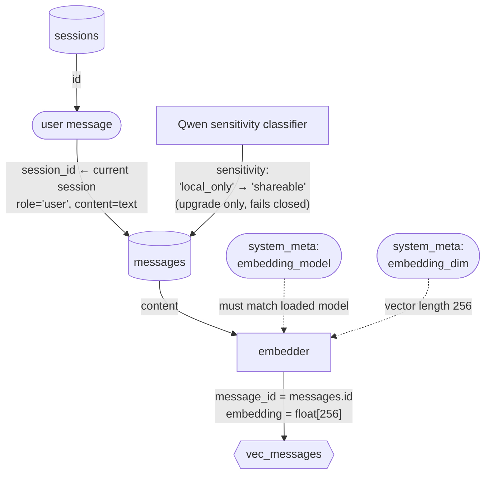

## 2. Ledger update (local Qwen)

Qwen reads the new message plus current ledger and makes *small targeted
writes* — never a full rewrite. This is the continuously-maintained state that
makes handoff O(1).

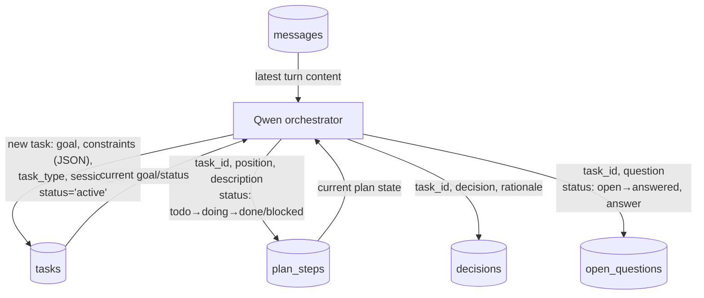

## 3. Skill-first check

Before spending cloud quota: has the system distilled a skill for this shape
of task?

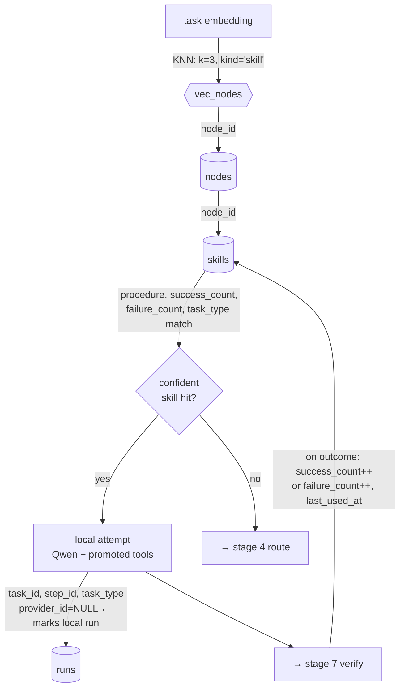

## 4. Route provider (bandit + meters)

Everything the router reads is **derived** — the only write is the new `runs`
row. Meters are views over `llm_calls`, never stored counters.

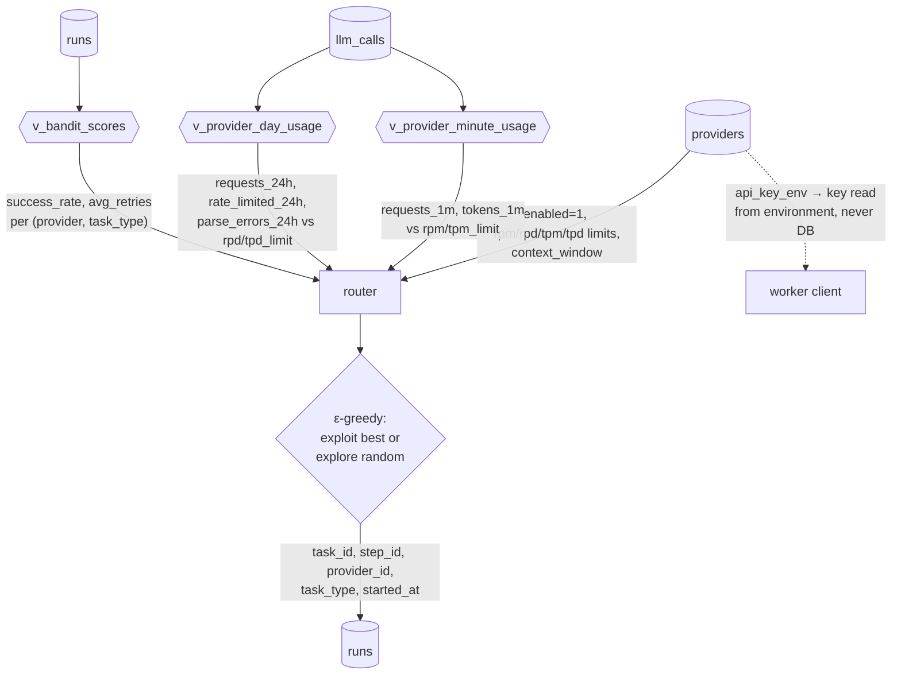

## 5. Render briefing pack

The handoff artifact. **Every read that leaves the machine passes the
sensitivity filter** — the renderer is the single choke point for the privacy
gate.

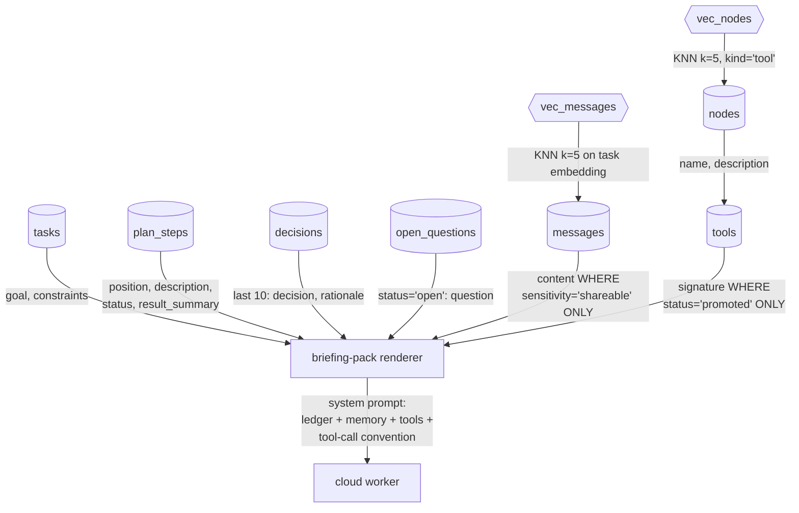

## 6. Worker loop (generate + plain-text tool calls)

One `llm_calls` row **per API request** — this append-only log is what the
meter views aggregate. Parse failures are first-class telemetry.

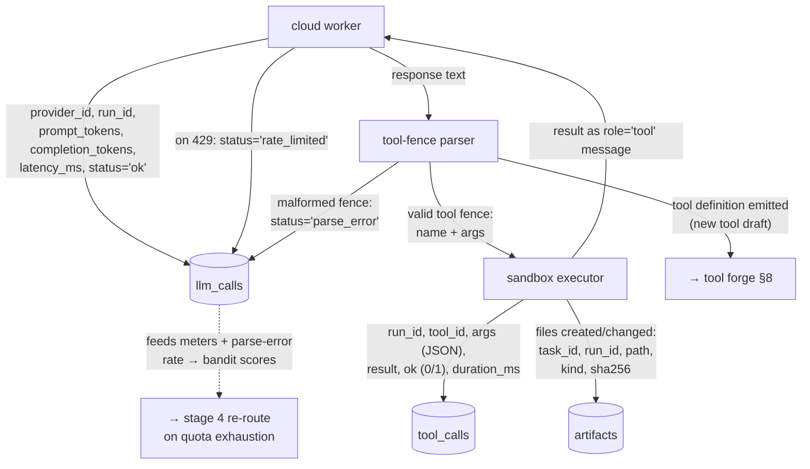

## 7. Sandbox verify → close the run

The worker stated its expected outcome *before* execution; the sandbox checks
the claim. This single `UPDATE` is what the bandit learns from.

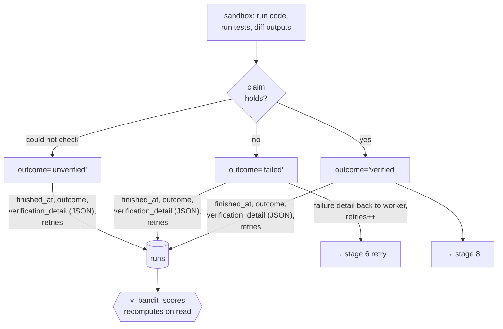

## 8. Synthesize, extract, distill (local Qwen, after reply streams)

All writes here are async — off the reply's critical path. This stage is the
only writer of `nodes`/`edges`, and the graph mirror is updated *last*, from
the relational rows just written (mirror never leads, only follows).

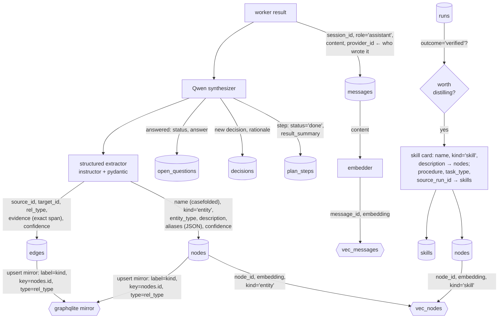

## 9. Tool Forge lifecycle (spans turns)

Status transitions on `tools.status`; the promotion gate (all tests pass) is
enforced in the promotion code path, not the schema.

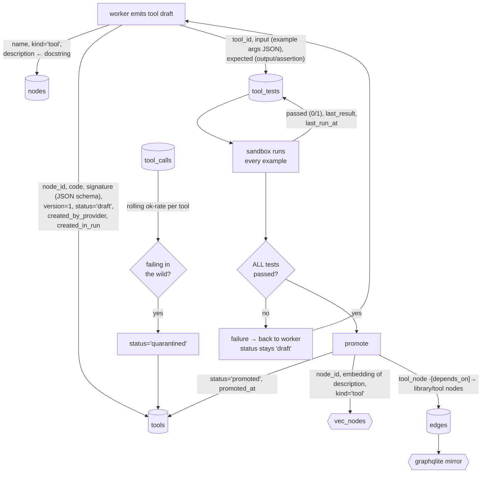

## 10. Meta & rebuild flows (each `system_meta` key its own node)

The rebuild contract from `DB_SCHEMA.md` §1, as a graph. Derived layers are
consumers only; every arrow into them originates in a relational table.

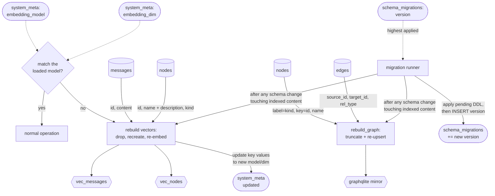

---

## Appendix — column lineage matrix

Who writes every meaningful column, at which stage, from what source.
(`id` PKs are auto-assigned; `created_at`/`started_at` are `DEFAULT` server
timestamps — omitted below unless set explicitly.)

### `sessions`
| Column | Stage | Fed by |
|---|---|---|
| `title` | 2 | Qwen, summarized from first user message |
| `metadata` | 1 | client context (UI origin, etc.), JSON |

### `messages`
| Column | Stage | Fed by |
|---|---|---|
| `session_id` | 1, 8 | current session |
| `role` | 1, 6, 8 | `'user'` (ingest) / `'tool'` (sandbox result) / `'assistant'` (worker reply) |
| `content` | 1, 6, 8 | raw text of the turn |
| `sensitivity` | 1 | default `'local_only'`; Qwen classifier upgrades to `'shareable'` |
| `provider_id` | 8 | `providers.id` of the worker that wrote the reply; NULL for user/system |
| `metadata` | any | free-form JSON |

### `nodes`
| Column | Stage | Fed by |
|---|---|---|
| `name` | 8, 9 | extractor entity name / tool name / skill name (casefolded, trimmed) |
| `kind` | 8, 9 | `'entity'` (extractor) / `'tool'` (forge draft) / `'skill'` (distillation) |
| `entity_type` | 8 | extractor `Entity.type` (Library, Framework, …) |
| `description` | 8, 9 | extractor `Entity.description` / tool docstring / skill summary — **this is what gets embedded** |
| `aliases` | 8 | extractor `Entity.aliases`, JSON array |
| `confidence` | 8 | extractor `Entity.confidence` |
| `sensitivity` | 8 | default `'shareable'`; classifier may demote |
| `last_accessed` | 3, 5 | touched on retrieval |

### `edges`
| Column | Stage | Fed by |
|---|---|---|
| `source_id`, `target_id` | 8, 9 | `nodes.id` of extracted pair / tool + its dependency |
| `rel_type` | 8, 9 | extractor `relationship_type` / `'depends_on'` (forge) |
| `evidence` | 8 | extractor `Relationship.evidence` (exact text span) |
| `confidence` | 8 | extractor `Relationship.confidence` |

### `tasks`
| Column | Stage | Fed by |
|---|---|---|
| `session_id` | 2 | current session |
| `goal` | 2 | Qwen, from user intent |
| `constraints` | 2 | Qwen, JSON array of hard requirements |
| `task_type` | 2 | Qwen classification — **routing key for bandit** |
| `status` | 2, 8 | Qwen lifecycle updates |
| `updated_at` | 2, 8 | set on every ledger write |

### `plan_steps`
| Column | Stage | Fed by |
|---|---|---|
| `task_id`, `position`, `description` | 2 | Qwen planning |
| `status` | 2, 8 | Qwen: `todo→doing` (dispatch), `→done/blocked` (synthesis) |
| `result_summary` | 8 | Qwen, one-liner from verified run output |

### `decisions` / `open_questions`
| Column | Stage | Fed by |
|---|---|---|
| `decision`, `rationale` | 2, 8 | Qwen, from user turns and run outcomes |
| `question` | 2 | Qwen, on ambiguity |
| `status`, `answer` | 8 | Qwen, when a run or user turn resolves it |

### `artifacts`
| Column | Stage | Fed by |
|---|---|---|
| `task_id`, `run_id` | 6 | active task/run |
| `path` | 6 | sandbox: file created/modified, relative to workspace |
| `kind` | 6 | sandbox classification (`file`/`tool`/`report`/…) |
| `sha256` | 6 | sandbox content hash at registration |

### `providers`
| Column | Stage | Fed by |
|---|---|---|
| all | manual/seed | operator config: name, base_url, model, `api_key_env` (env-var **name**), declared limits, enabled |

### `llm_calls`
| Column | Stage | Fed by |
|---|---|---|
| `provider_id`, `run_id` | 6 | active dispatch |
| `prompt_tokens`, `completion_tokens` | 6 | API response `usage` object |
| `latency_ms` | 6 | client-measured wall time |
| `status` | 6 | `'ok'` / `'rate_limited'` (429) / `'timeout'` / `'error'` / `'parse_error'` (bad tool fence) |
| `error` | 6 | raw error body, truncated |

### `runs`
| Column | Stage | Fed by |
|---|---|---|
| `task_id`, `step_id` | 3, 4 | active ledger position |
| `provider_id` | 4 | router pick; **NULL = local skill-card run** |
| `task_type` | 4 | copied from `tasks.task_type` at dispatch (denormalized for the bandit view) |
| `finished_at`, `outcome` | 7 | sandbox verification: `verified`/`failed`/`unverified`/`aborted` |
| `verification_detail` | 7 | JSON: claim, checks run, diffs |
| `retries` | 7 | incremented per stage-6 retry |

### `tools`
| Column | Stage | Fed by |
|---|---|---|
| `node_id` | 9 | the tool's `nodes` row |
| `signature` | 9 | worker-emitted params JSON schema |
| `code` | 9 | worker-emitted source; `version++` on each accepted revision |
| `status` | 9 | `draft` (emit) → `promoted` (all tests pass) → `quarantined` (in-the-wild failures) / `deprecated` (manual) |
| `created_by_provider`, `created_in_run` | 9 | provenance of the authoring dispatch |
| `promoted_at` | 9 | promotion timestamp |

### `tool_tests`
| Column | Stage | Fed by |
|---|---|---|
| `tool_id`, `input`, `expected` | 9 | authoring worker's example invocations |
| `passed`, `last_result`, `last_run_at` | 9 | sandbox test run |

### `tool_calls`
| Column | Stage | Fed by |
|---|---|---|
| `run_id`, `tool_id`, `args` | 6 | parsed tool fence |
| `result`, `ok`, `duration_ms` | 6 | sandbox execution |

### `skills`
| Column | Stage | Fed by |
|---|---|---|
| `node_id` | 8 | the skill's `nodes` row |
| `procedure` | 8 | Qwen distillation: steps + tools used + pitfalls (markdown) |
| `task_type` | 8 | from the source run |
| `source_run_id` | 8 | the verified cloud run it was learned from |
| `success_count`, `failure_count`, `last_used_at` | 3/7 | incremented when a local skill-card run verifies/fails |

### `system_meta` (each key an independent node)
| Key | Stage | Fed by |
|---|---|---|
| `embedding_model` | seed / rebuild (10) | operator config; updated only after a successful vector rebuild |
| `embedding_dim` | seed / rebuild (10) | ditto (currently `256`) |

### `schema_migrations`
| Column | Stage | Fed by |
|---|---|---|
| `version` | migration (10) | migration runner, after applying DDL |

### Derived layers (never written directly by business logic)
| Object | Rebuilt from | Trigger |
|---|---|---|
| `vec_messages` | `messages(id, content)` | embedding model/dim change |
| `vec_nodes` | `nodes(id, name, description, kind)` | embedding model/dim change |
| graphqlite mirror | `nodes` + `edges` | any mirror doubt → `rebuild_graph()` |
| `v_provider_*_usage` | `llm_calls` | view — always live |
| `v_bandit_scores` | `runs` | view — always live |
